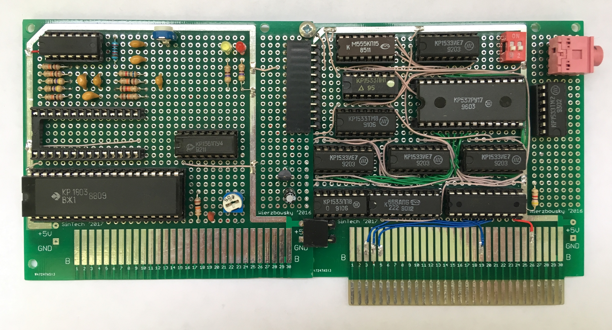

# Agat Speech Board

КР1803ВЖ1 (TMS5100) based speech synthesizer board for [Agat](https://en.wikipedia.org/wiki/Agat_(computer)) computer.

Schematics was designed in KiCad EDA with a custom parts lib.
Software was created using [cc65](https://cc65.github.io/) compiler. And it works on Agat only in Apple II compatibility mode.

## Project files
- Schematics in KiCad format: [schematics/AgatSpeechBoard](schematics/AgatSpeechBoard), PNG: [Control](schematics/AgatSpeechBoard/AgatSpeechBoard_sch.png), [Analog](schematics/AgatSpeechBoard/AgatSpeechBoard_analog_sch.png)
- ATF16v8 PLD firmware: [PLD Firmware](src/ATF16V8)
- Speak program sources for Agat-9 Apple II mode: [src/speak](src/speak)
- Various datasheets for КР1803ВЖ1 and TMS5100 chips: [docs](docs)
- "Talking Dice" circuit based on TMS5100 chip: [docs/Talking Dice](docs/Talking%20Dice)

## [Chaos Constructions 2019](http://c-c.ru) public report
- Presentation (in Russian): [Синтезатор речи для ПЭВМ Агат.pdf](docs/Синтезатор%20речи%20для%20ПЭВМ%20Агат.pdf)
- Full software demo: https://www.youtube.com/watch?v=xI7s3mxBhng
- Russian phrases: https://www.youtube.com/watch?v=0sAlXTVFXQc
- Speak and Spell emulator: https://www.youtube.com/watch?v=E4hqrfArUSM